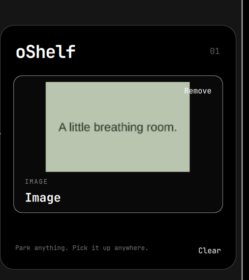

# oShelf

**Park anything. Pick it up anywhere.**

A small, temporary shelf at the right edge of your Omarchy desktop. Drop something
there, switch context, and drag it into another application.

- Files and folders stay where they are; cards carry references.
- Multiple files travel together in one card.
- Images get thumbnails, links get domain previews, and text stays readable.
- Portable MIME formats retain their original bytes, including binary data.
- One shelf across monitors and workspaces. No bar widget or permanent sidebar.
- Current Omarchy colors and typography. No settings required.

## Install

Requires **Omarchy Quattro with its Quickshell plugin host**, Qt 6.8 or newer,
and Python 3 (included with Omarchy). Building the small native Qt drag component
requires `gcc`, `make`, `pkgconf`, `qt6-base`, and `qt6-declarative`. No extra Python
packages or privileged installer. Earlier Omarchy releases without the shell plugin host are unsupported.

```sh
omarchy plugin add https://github.com/i12bp8/oShelf
make -C ~/.config/omarchy/plugins/io.github.i12bp8.oshelf
omarchy plugin enable io.github.i12bp8.oshelf
```

After plugin or Qt updates, rebuild with `make` in the installed directory and restart
the shell after finishing any active transfer.

For a local checkout, run `./scripts/install.sh`. It validates and copies the
runtime files and the locally built native component into the user plugin directory, then enables the plugin through
Omarchy. It refuses to replace an existing installation.

Remove it with:

```sh
omarchy plugin remove io.github.i12bp8.oshelf
```

Or run `./scripts/uninstall.sh`. No configuration edits, shortcuts, persistent
payload files, or background service remain to remove separately.

## Carry something

1. Drag toward the middle of the right screen edge. The small landing mark brightens.
2. Move into the shelf and release.
3. Switch workspace or application. Hover at the same edge to reopen it.
4. Drag a card into the destination.

Drag cards onto one another to reorder. Hover or focus a card to reveal **Remove**.
**Clear** empties the shelf. Pickup uses copy semantics and keeps the card until
you remove it; original files are never moved or deleted.

**Escape** collapses. **Tab** focuses controls/cards; **Delete** removes a focused
card; **Ctrl+Up/Down** reorders it; **Ctrl+Backspace** clears. For an optional launcher
or shortcut, use `omarchy-shell oshelf show`. No shortcut is installed automatically.

## What can be carried

| Source | Representation | Transfer |
| --- | --- | --- |
| Local file / folder | Filename / folder card | Original local file URI |
| Multiple local files | One bundle | Original URI list |
| PNG, JPEG, WebP data | Thumbnail when small enough | Original encoded image bytes |
| Browser image | Image or domain card, depending on the browser's offer | Offered image bytes and/or URL |
| Web link | Domain and URL | Offered URL and text formats |
| Selected text | Plain text preview | Original text and any portable rich-text formats |
| Other MIME data | Transfer card | Original portable bytes |

Destinations choose the format they understand. Image-only drags do not become
files: file managers that require file URIs may reject them. Carry a saved image
file when you need that behavior. No web requests are made for previews, including
favicons. HTML is carried but never rendered. Process-local Qt, portal, browser
file tokens, and file-manager cut instructions are excluded.

The landing area is **8 logical pixels wide and at most 240 pixels tall**, centered
on each display's right edge. Wayland provides drag events only after entry into
that area. It also opens on ordinary hover; there is no global drag surveillance.
It reserves no desktop space. Adjacent monitor edges may be crossed normally
outside that small landing area.

Contents live in memory until removed, disabled, reloaded, or the shell/session
ends. There is no history or disk persistence. References to moved/deleted files
are marked unavailable when reopened; a destination can still encounter a file
that disappears after that check. Source-owned temporary files remain references.

Limits: 48 cards, 256 references per card, 16 MiB of MIME bytes per card and 64 MiB
across the shelf. Preview encoding is limited to 2 MiB; larger images still carry
their bytes. Qt receives source data before oShelf can check its size, so these are
retention limits, not a sandbox against a malicious or stalled drag source.

## Development

```sh
make
omarchy plugin validate .
node --test tests/payload.test.cjs
python3 tests/metadata_test.py
```

See [verification](docs/verification.md), [architecture](docs/architecture.md),
and [marketplace preparation](docs/marketplace.md).



MIT licensed. No telemetry, clipboard monitoring, network access, or content logs.
